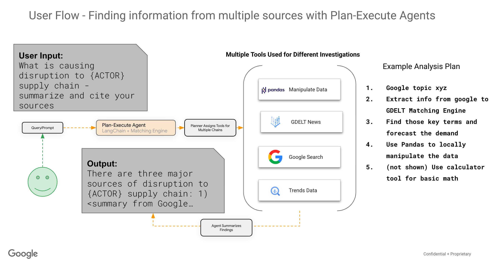

# Welcome to the Zeitghost - Build Your Own News & Media Listening Platform with a Conversational Agent

The repo contains a set of notebooks and helper classes to enable you to create a conversational agent with access to a variety of datasets and APIs (tools) to answer end-user questions.

By the final notebook, you'll have created an agent with access to the following tools:
* News and media dataset (GDELT) index comprised of global news related to your `ACTOR`
* The [Google Trends](https://trends.google.com/trends/explore?hl=en) public dataset. This data source helps us understand what people are searching for, in real time. We can use this data to measure search interest in a particular topic, in a particular place, and at a particular time
* [Google Search API Wrapper](https://developers.google.com/custom-search/v1/overview) - to retrieve and display search results from web searches
* A calculator to help the LLM with math
* An [SQL Database Agent](https://python.langchain.com/en/latest/modules/agents/toolkits/examples/sql_database.html) for interacting with SQL databases (e.g., BigQuery). As an example, an agent's plan may require it to search for trends in the Google Trends BigQuery table

### **Below is an image showing the user flow interacting with the multi-tool agent using a plan-execute strategy**:
<center>

</center>

### **Here's an example of what the user output will look like in a notebook**:
<center>

</center>

## GDELT: A global database of society

Google's mission is to organise the world's information and make it universally accessible and useful. Supported by Google Jigsaw, the [GDELT Project](https://www.gdeltproject.org/) monitors the world's broadcast, print, and web news from nearly every corner of every country in over 100 languages and identifies the people, locations, organizations, themes, sources, emotions, counts, quotes, images and events driving our global society every second of every day, creating a free open platform for computing on the entire world.

Monitoring nearly the entire world's news media is only the beginning - even the largest team of humans could not begin to read and analyze the billions upon billions of words and images published each day. GDELT uses some of the world's most sophisticated computer algorithms, custom-designed for global news media, running on "one of the most powerful server networks in the known Universe", together with some of the world's most powerful deep learning algorithms, to create a realtime computable record of global society that can be visualized, analyzed, modeled, examined and even forecasted. A huge array of datasets totaling trillions of datapoints are available. Three primary data streams are created, one codifying physical activities around the world in over 300 categories, one recording the people, places, organizations, millions of themes and thousands of emotions underlying those events and their interconnections and one codifying the visual narratives of the world's news imagery.

All three streams update every 15 minutes, offering near-realtime insights into the world around us. Underlying the streams are a vast array of sources, from hundreds of thousands of global media outlets to special collections like 215 years of digitized books, 21 billion words of academic literature spanning 70 years, human rights archives and even saturation processing of the raw closed captioning stream of almost 100 television stations across the US in collaboration with the Internet Archive's Television News Archive. Finally, also in collaboration with the Internet Archive, the Archive captures nearly all worldwide online news coverage monitored by GDELT each day into its permanent archive to ensure its availability for future generations even in the face of repressive forces that continue to erode press freedoms around the world.

For more information on how to navigate the datasets - see the [GDELT 2.0 Data format codebook](http://data.gdeltproject.org/documentation/GDELT-Event_Codebook-V2.0.pdf)

** How to add GDELT 2.0 to your Google Cloud Project **


## Large Data from GDELT needs Effective and Efficient Knowledge Retrieval

Simply accessing and storing the data isn't enough. Processing large queries of news sources from GDELT is easy to do with BigQuery, however to accelerate exploration and discovery of the information, tools are needed to provide semantic search on the contents of the global news and media dataset.

[Vertex AI Matching Engine](https://cloud.google.com/vertex-ai/docs/matching-engine/overview) provides the industry's leading high-scale low latency vector database. These vector databases are commonly referred to as vector similarity-matching or an approximate nearest neighbor (ANN) service. Vertex AI Matching Engine provides the ability to scale knowledge retrieval paired with our new [Vertex Embeddings Text Embeddings](https://cloud.google.com/vertex-ai/docs/generative-ai/embeddings/get-text-embeddings). We use document chunking and [`newspaper3k`](https://pypi.org/project/newspaper3k/) to pull down the articles and convert the document passages into embeddings with the Vertex Embeddings API (via Python SDK).

Below is an example depiction of the information architecture, utilizing Matching Engine and the text embeddings model. 


## Leveraging GenAI Language Models to get Relevant & Real-time Information Using Conversational Agents 
More than ever, access to relevant and real-time information to make decisions and understand changing patterns and trends critical. Whilst GDELT contains a massive amount of relevant and real-time (up to every 15 min) data, it can be challenging and overwhelming to make sense of it and extract what is most important for specific areas of interest, topics, events, entities. This project, the Zeitghost, provides a reference solution for how you can specify your entities and events of interest to extract from GDELT, index and load them into a vector database, and leverage the Vertex AI Generative Language models with Langchain Agents to interact in a Q&A style with the information. We also show how you can orchestrate and schedule ongoing refreshes of the data to keep the system up to date with the latest information. 

For more information about getting started with Langchain Agents, see [Langchain Examples](https://github.com/GoogleCloudPlatform/generative-ai/tree/dev/language/examples/oss-samples/langchain)

Finally, to go beyond an agent with one chain of thought along with one tool, we explore how you can start to combine plan-and-execute agents together. [Plan-and-execute Agents](https://python.langchain.com/en/latest/modules/agents/plan_and_execute.html) accomplish an objective by first planning what to do, then executing the sub tasks
* This idea is largely inspired by [BabyAGI](https://github.com/yoheinakajima/babyagi) and the [Plan-and-Solve](https://arxiv.org/abs/2305.04091) paper.
* The planning is almost always done by an LLM.
* The execution is usually done by a separate agent (**equipped with tools**)
By allowing agents with access to different source data to interact with each other, we can uncover new insights that may not have been obvious by examining each of the datasets in isolation. 

## Solution Overview

### Architecture


### Detailed Components


### Component Flow
This project consists of a series of notebooks leveraging a customized code base to:
- Filter and extract all of the relevant web URLs for a given entity from the GDELT global entity graph or a type of global event for a specified time period leveraging the GDELT data that is publicly available natively in BigQuery. An example could be an ACTOR='World Health Organization', for the time period of March 2020 to Present, including events about COVID lockdown. 
- Extract the full article and news content from every URL that is returned from the GDELT datasets and generate text embeddings using the [Vertex AI Embeddings Model](https://cloud.google.com/vertex-ai/docs/generative-ai/embeddings/get-text-embeddings) 
- Create a [Vertex AI Matching Engine](https://cloud.google.com/vertex-ai/docs/matching-engine/overview) Vector Database Index deploy it to an Index Endpoint
- Insert the generated embeddings into the Matching Engine Vector Database Index 
- Create a pipeline to orchestrate the ongoing refresh of the GDELT data into the Vector DB

- Test the generic semantic search capabilities of the Vector DB, and test using a Langchain Agent with one chain of thought along with one tool
- Create a plan-and-execute agent framework where different agents (the GDELT Langchain agent, a BigQuery public trends agent, and a Google Search API agent) are able to talk to each other to answer questions


Next, we are currently working on adding:
- An application to build and deploy the conversational agent as an API on Google Cloud Run - where it can then be integrated into any application. 
- A customizable front end reference architecture that uses the agents once , which can be used to showcase the art of the possible when working 
- Incorporating future enhancements to the embedding techniques used to improve the relevancy and performance of retrieval 


# Using the notebooks
## Create Vertex Workbench Instance & Setup VPC Peering

### Important: be sure to create Vertex AI notebook instance within the same VPC Network used for Vertex AI Matching Engine deployment
If you don't use the same VPC network, you will not be able to make calls to the matching engine vector store database

Similar to the setup instructions for Matching Engine in this [Sample Notebook](https://github.com/GoogleCloudPlatform/vertex-ai-samples/blob/main/notebooks/official/matching_engine/sdk_matching_engine_for_indexing.ipynb), there are a few permissions needed in order to be able to create the VPC network and set up VPC peering. 

The following code can be used to create the network and VPC peering needed for Matching Engine Private Endpoint:
```
VPC_NETWORK="YOUR_NETWORK_NAME"
PROJECT_ID="YOUR_PROJECT_ID"
PEERING_RANGE_NAME="PEERINGRANGENAME"

# Create a VPC network
gcloud compute networks create $VPC_NETWORK --bgp-routing-mode=regional --subnet-mode=auto --project=$PROJECT_ID

# Add necessary firewall rules
gcloud compute firewall-rules create $VPC_NETWORK-allow-icmp --network $VPC_NETWORK --priority 65534 --project $PROJECT_ID --allow icmp

gcloud compute firewall-rules create $VPC_NETWORK-allow-internal --network $VPC_NETWORK --priority 65534 --project $PROJECT_ID --allow all --source-ranges 10.128.0.0/9

gcloud compute firewall-rules create $VPC_NETWORK-allow-rdp --network $VPC_NETWORK --priority 65534 --project $PROJECT_ID --allow tcp:3389

gcloud compute firewall-rules create $VPC_NETWORK-allow-ssh --network $VPC_NETWORK --priority 65534 --project $PROJECT_ID --allow tcp:22

# Reserve IP range
gcloud compute addresses create $PEERING_RANGE_NAME --global --prefix-length=16 --network=$VPC_NETWORK --purpose=VPC_PEERING --project=$PROJECT_ID --description="peering range"

# Set up peering with service networking
# Your account must have the "Compute Network Admin" role to run the following.
gcloud services vpc-peerings connect --service=servicenetworking.googleapis.com --network=$VPC_NETWORK --ranges=$PEERING_RANGE_NAME --project=$PROJECT_ID
```

### gcloud command to create your Vertex AI Workbench notebook:
Using this base image will ensure you have the proper starting environment to use these notebooks. You can optionally remove the flag to add the GPU. 

```bash
INSTANCE_NAME='your-instance-name'

gcloud notebooks instances create $INSTANCE_NAME \
  --vm-image-project=deeplearning-platform-release \
  --vm-image-family=tf-ent-2-11-cu113-notebooks-debian-11-py39 \
  --vm-image-family=tf-latest-cu113-debian-11-py39 \
  --machine-type=n1-standard-8 \
  --location=us-central1-a \
  --network=$VPC_NETWORK
```
## Notebooks
0. [Environment Setup](https://github.com/GoogleCloudPlatform/generative-ai/blob/main/language/intro_palm_api.ipynb) - used to create configurations once that can be used for the rest of the notebooks
1. [Setup Vertex Vector Store](https://github.com/GoogleCloudPlatform/generative-ai/blob/main/language/intro_palm_api.ipynb) - create the Vertex AI Matching Engine Vector Store Index, deploy it to an endpoint. This can take 40-50 min, so whilst waiting the next notebook can be run. 
2. [GDELT DataOps](https://github.com/GoogleCloudPlatform/generative-ai/blob/main/language/intro_palm_api.ipynb) - parameterize the topics and time period of interest, run the extraction against GDELT for article and news content
3. [Vector Store Index Loader](https://github.com/GoogleCloudPlatform/generative-ai/blob/main/language/intro_palm_api.ipynb) - create embeddings and load the vectors into the Matching Engine Vector Store. Test the semantic search capabilities and langchain agent using the Vector Store.
4. [Build Zeitghost Image](https://github.com/GoogleCloudPlatform/generative-ai/blob/main/language/intro_palm_api.ipynb) - create a custom container to be used to create the GDELT pipeline for ongoing data updates
5. [GDELT Pipelines](https://github.com/GoogleCloudPlatform/generative-ai/blob/main/language/intro_palm_api.ipynb) - create the pipeline to orchestrate and automatically refresh the data and update the new vectors into the matching engine index
6. [Plan and Execute Agents](https://github.com/GoogleCloudPlatform/generative-ai/blob/main/language/intro_palm_api.ipynb) - create new agents using the BigQuery public trends dataset, and the Google Search API, and use the agents together to uncover new insights 
